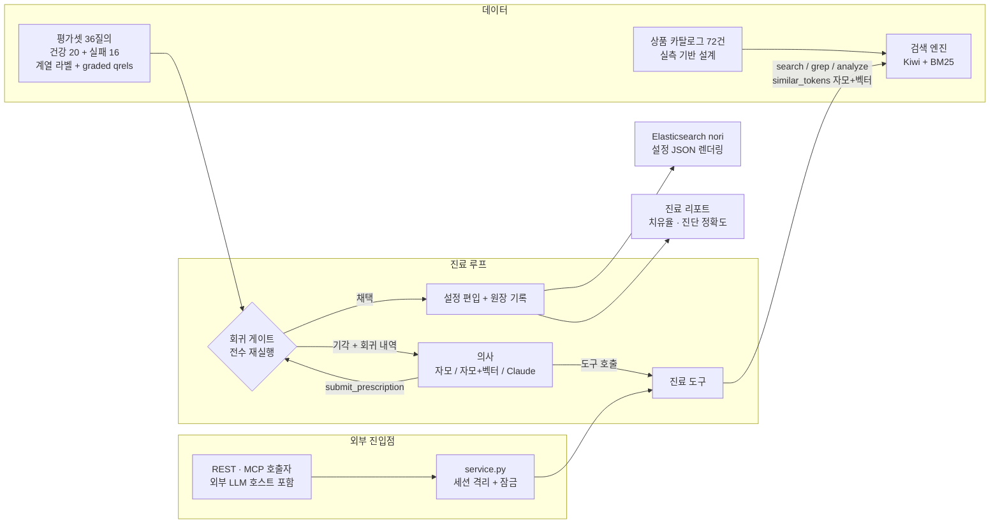

# ko-search-clinic

[](https://github.com/sokldjs554/ko-search-clinic/actions/workflows/ci.yml)

**한국어 검색 품질 자가 치유 에이전트 — 진단 · 처방 · 검증 · 롤백**

한국어 검색은 조용히 실패합니다. `후라이팬`을 검색하면 `프라이팬` 상품이 0건이고,
`티슈`를 검색하면 `물티슈`는 영원히 안 나옵니다. 형태소 분석기가 단어를 어떻게
부수는지 보면 이유가 드러납니다.

```console
$ clinic analyze "아답터"
입력: 아답터
  답             NNG    (kiwi)
  터             NNG    (kiwi)
  아             IC     (버려짐 — 내용어가 아님)
  → 색인 토큰: ['답', '터']
```

`아답터`의 첫 음절은 감탄사(IC)로 오인돼 버려지고, 남은 `[답, 터]`는 무엇과도
매칭되지 않습니다. `백팩`은 더 나쁩니다. `백`이 수사(NR, 숫자 100)로 읽혀
에코백·물티슈 **12팩**이 검색됩니다. 0건이 아니라 쓰레기 4건이라 "검색은
되는데요"로 넘어가기 쉽습니다.

현장의 대응은 수동입니다. 누군가 민원을 받고 사전이나 동의어 파일을 고치고,
**그 수정이 다른 검색을 망가뜨렸는지는 아무도 확인하지 않습니다.**

```
실패 질의 → [진단] 왜 못 찾았나 — 형태소 단위 원인 규명 (5개 실패 계열)
         → [처방] 타입 있는 패치 — 사용자 사전 | 동의어 | 복합어 분해 확장
         → [검증] 회귀 게이트 — 평가셋 36질의 전수 재실행
         → [채택] 원장에 증거와 함께 기록  /  [기각] 회귀 내역 반환 → 재처방
```

처방은 의사의 확신이 아니라 전수 재실행 결과로 채택됩니다. 기각 = 롤백이며,
채택된 모든 패치에는 "왜 넣었는지"의 증거가 원장에 남습니다.

## 핵심 결과

의사 다섯이 동일한 평가셋 16건을 순회 진료했습니다. 같은 상태 기계에 자를
하나씩 더 준 구성이라, 다섯의 차이가 곧 "그 자가 무엇을 더 푸는가"입니다.

| 지표 | 베이스라인 | 자모만 | +2단계·재시도 | 자모+임베딩 | 전부 | Claude |
|---|---|---|---|---|---|---|
| 치유율 | — | 10/16 (62%) | 11/16 (69%) | 11/16 (69%) | 12/16 (75%) | **16/16 (100%)** |
| 진단 정확도 | — | 62% | 69% | 75% | 81% | **100%** |
| 실패셋 평균 nDCG@10 | 0.070 | 0.695 | 0.757 | 0.737 | 0.799 | **0.980** |
| 건강셋(20건) 회귀 | — | **0건** | **0건** | **0건** | **0건** | **0건** |

가운데 두 열(`rules+`, `vector+`)은 비교가 공정했는지 되물어 만든 팔입니다.
"LLM이 이긴 것은 추론이 아니라 액션 스페이스(`user_words`)와 재시도 아니냐"는
반론에, 규칙 의사에 그 둘을 붙여 다시 쟀습니다. 회수된 것은 **1건**(`아답터`)이고
임베딩까지 다 켜도 **12/16**에서 멈춥니다 ([측정 전문](docs/FAIRNESS.md)).
LLM을 호출하지 않으므로 API 키 없이 재현됩니다.

```console
$ clinic heal --engine rules+     # 11/16
$ clinic heal --engine vector+    # 12/16
```

| 계열 | 예 | 자모 | +임베딩 | 규칙 최대치 | Claude |
|---|---|---|---|---|---|
| 표기 변형 (8건) | 후라이팬→프라이팬 | ✅ 8/8 | ✅ 8/8 | ✅ 8/8 | ✅ 8/8 |
| 복합어 통짜 (2건) | 티슈↛물티슈 | ✅ 2/2 | ✅ 2/2 | ✅ 2/2 | ✅ 2/2 |
| **영한 혼용 (2건)** | 블루투스↛Bluetooth | ❌ 0/2 | ❌ 0/2 | ❌ 0/2 | **✅ 2/2** |
| **유의어 (2건)** | 츄리닝↛트레이닝복 | ❌ 0/2 | ⭕ 1/2 | ⭕ 1/2 | **✅ 2/2** |
| **쓰레기 분해 (2건)** | 아답터→[아,답,터] | ❌ 0/2 | ❌ 0/2 | ⭕ 1/2 | **✅ 2/2** |

### 임베딩은 이 문제에 맞지 않았습니다

임베딩이 더한 것은 정확히 한 건(`핸드폰`)입니다. 정답 쌍과 오답 쌍의 유사도
분포가 완전히 겹치고 순서까지 뒤집혀 있습니다.

| 이어야 하는 쌍 | | 이으면 안 되는 쌍 | |
|---|---|---|---|
| 핸드폰 ↔ 휴대폰 | **0.979** | 백팩 ↔ **팩** | **0.941** |
| 백팩 ↔ 배낭 | 0.785 | 카페트 ↔ **방지** | 0.871 |
| 블루투스 ↔ bluetooth | 0.571 | 선풍기 ↔ **팬** | 0.598 |
| 도너츠 ↔ 도넛 | **0.381** | 프라이팬 ↔ **팬** | 0.581 |

더 결정적인 것은 **정답이 후보 목록 안에 없다**는 사실입니다. 어휘 438개에서
정답의 유사도 순위는 `어댑터` 155위 · `bluetooth` 229위 · `배낭` 254위 ·
`트레이닝복` 411위입니다. 의사는 상위 8개만 보므로 임계값을 0까지 내려도
이 후보들은 보이지 않습니다. 거르는 문제가 아니라 불러오는 문제였습니다.

"다국어 모델이라 그런 것 아닌가"에 답하려고 한국어 전용 모델
(`jhgan/ko-sroberta-multitask`)로 캐시만 갈아끼워 다시 돌렸습니다. 치유 11/16 ·
패치 11건이 용어까지 동일했습니다. 독립적으로 학습된 두 모델이 같은 곳에서
성공하고 같은 곳에서 실패했으므로 **모델 선택의 문제가 아닙니다**
([분포·허브 분석](docs/EVALUATION.md#벡터-의사-실측--임베딩이-어디까지-하는가) ·
[재현](docs/VECTOR_PROBE.md)).

전체 진료 기록: [CLINIC_REPORT_CLAUDE.md](docs/CLINIC_REPORT_CLAUDE.md) ·
원장: [LEDGER_CLAUDE.json](docs/LEDGER_CLAUDE.json) ·
분석과 한계: [EVALUATION.md](docs/EVALUATION.md)

> **100%를 그대로 믿으면 안 되는 이유도 적어 두었습니다.** 코퍼스와 평가셋은
> 제가 설계했고, 16건 전부가 1회 제출로 통과해 자가 수정 루프는 실전에서 아직
> 한 번도 안 돌았습니다 ([한계 세 가지](docs/EVALUATION.md#정직하게-남기는-세-가지-한계)).
> 평가 하니스 자신의 결함도 실측이 찾아냈습니다 —
> [분석](docs/EVALUATION.md#평가-하니스-자신의-결함--실측이-찾아낸-것).

## 회귀 게이트

```console
$ clinic demo-trap
시연: '후라이팬'을 고치려고 과잉 동의어(프라이팬=후라이팬=팬)를 제출하면?

기각: 다른 질의 2건에 회귀 발생
  - 회귀: '프라이팬' ndcg 1.00 → 0.65
  - 회귀: '프라이팬' precision5 1.00 → 0.40
  - 회귀: '팬미팅 굿즈' precision5 0.50 → 0.40
처방을 더 좁히거나(대상 항목 축소) 다른 패치 유형을 검토하라.

올바른 최소 처방(프라이팬=후라이팬)을 제출하면?

채택. 표적 '후라이팬' nDCG 0.00 → 1.00, 회귀 없음.
```

`팬` 토큰을 가진 팬미팅 굿즈·선풍기 문서가 프라이팬 검색에 쏟아져 들어오는 것을
전수 재실행이 잡아냅니다. nDCG만으로는 부족해 precision@5를 함께 봅니다 —
nDCG는 정답 아래에 쌓이는 쓰레기를 벌하지 않기 때문입니다.

## CI 품질 게이트

위 게이트는 **처방 하나**를 판정합니다. 그런데 코퍼스 문서 수정, 분석기 기본
설정 변경, 손으로 추가한 사전 항목은 게이트를 거치지 않습니다. 현업에서 검색이
조용히 깨지는 경로가 정확히 그것입니다.

매 푸시마다 평가셋 36질의를 재실행해 커밋된 기준선과 질의별로 대조하고, 회귀가
있으면 빌드를 막습니다. 진료 게이트와 같은 허용치(ε=0.02)를 씁니다.

```console
$ clinic baseline          # 상품명 하나에서 '프라이팬'을 지워보면
검색 품질 회귀 — 평균 nDCG 0.5839 → 0.5732
  - 회귀: '팬미팅 굿즈' precision5 0.50 → 0.40 (↓0.10)
  - 회귀: '프라이팬' ndcg 1.00 → 0.61 (↓0.39)
  - 회귀: '프라이팬' recall 1.00 → 0.50 (↓0.50)
$ echo $?
1
```

**`팬미팅 굿즈`가 같이 걸린 것이 이 검사의 값어치입니다.** 프라이팬 상품 하나를
고쳤는데 전혀 다른 질의가 흔들렸고(문서빈도가 변해 BM25 점수가 이동), 사람이
리뷰로 예측할 수 있는 종류의 일이 아닙니다.

**질의를 지워서 초록불을 만들 수는 없습니다.** 기준선에 있던 질의가 평가셋에서
사라지면 그것도 실패로 셉니다.

## 규모

이 프로젝트의 결론은 전부 문서 72건 · 질의 36건 위에서 나왔습니다. 합성
코퍼스로 규모를 키워 같은 처방을 다시 던졌습니다.

| 문서 수 | 색인(초) | 게이트 1회(초) | '팬' 문서수 | 과잉 처방 | 최소 처방 |
|---|---|---|---|---|---|
| 72 | 4.43 | 0.04 | 4 | 기각 ✅ | 채택 ✅ |
| 1,072 | 0.57 | 0.56 | 24 | 기각 ✅ | 채택 ✅ |
| 10,072 | 5.30 | 5.46 | 204 | 기각 ✅ | 채택 ✅ |
| 50,072 | 27.70 | 27.50 | 1,004 | 기각 ✅ | 채택 ✅ |

**게이트의 정확성에는 규모 조건이 붙지 않았습니다.** `팬` 문서가 4건에서
1,004건으로 늘어도 오염은 여전히 탐지됩니다.

**하지만 비용은 선형이었습니다.** 문서가 50배 늘 때 게이트 1회가 49배로
늘었습니다. 이 기울기면 문서 100만 건에서 처방 하나에 약 9분, 진료 16건이면
하루가 갑니다. **벽은 정확성이 아니라 비용**이고, 실서비스에 올리려면 증분
재색인이 먼저입니다.

### 로그 마이닝

실서비스에서 진료 대상은 로그가 고릅니다. 질의 로그 50만 줄을 Parquet 데이터
레이크(날짜 파티션)에 두고 제로결과 질의를 집계했습니다.

```console
$ clinic build-lake --docs 50000 --log-rows 500000
$ clinic mine-logs --engine duckdb
| 순위 | 질의 | 질의량 | 제로결과 | 제로율 |
| 1 | 후라이팬 | 14830 | 14830 | 100% |
| 2 | 케잌 주문 | 6134 | 6134 | 100% |
| 8 | 프리미엄 키보드 | 9469 | 2785 | 29% |
```

제로결과 **횟수** 순으로 정렬합니다. 고쳤을 때 영향받는 검색 횟수가 곧
우선순위이고, 제로율이 100%여도 아무도 안 치는 질의는 나중입니다.

Spark와 DuckDB가 같은 SQL로 같은 결과를 냅니다. 다만 이 규모에서는 DuckDB가
**48배 빨랐습니다**(0.27초 vs 13초). Spark가 값을 하는 것은 로그가 한 대
메모리를 넘을 때이고, **규모가 아닌데 Spark를 쓰는 것은 비용만 냅니다.**

### 영속 저장소

세션·패치 원장을 PostgreSQL에 둡니다(`DATABASE_URL`). 저장하는 것은 **처방과 그
증거뿐**입니다 — 색인이나 분석기 상태는 처방으로부터 결정적으로 재구성되므로
저장하면 두 벌이 되고, 두 벌은 갈라집니다.

만들면서 결함을 하나 잡았습니다. 재시작 후 설정은 살아나는데 원장이 비어
있었습니다. 운영 중 재시작 뒤가 그 근거가 가장 필요한 순간이라 고쳤고, 회귀
테스트로 고정했습니다. DB가 없으면 메모리로 돌며, **DB 없이 도는 것이 기본
상태**입니다.

## 관련 연구와의 거리

OpenSearch의 [Agentic Relevance Tuning (ART)](https://opensearch.org/blog/agentic-relevance-tuning/)
은 LLM 에이전트가 관련성 신호를 읽고 → 가설을 세우고 → 오프라인 평가로
검증하고 → 통과한 것만 배포하는 루프를 제안합니다. 문제의식이 같습니다. 독립적인
조직이 같은 문제를 같은 방식으로 정의했다는 것이 이 접근의 타당성을 뒷받침한다고
보고, 숨기지 않고 적습니다.

| | ART (OpenSearch) | ko-search-clinic |
|---|---|---|
| **고치는 층** | 질의·랭킹 설정 | **분석기·색인 층** (사전, 동의어, 복합어 분해) |
| **진단 근거** | UBI — 클릭·전환 로그 | **형태소 분석 결과 자체** (`analyze_text`) |
| **대상 언어** | 언어 중립 | **한국어 형태소** (Kiwi / ES nori) |

층이 다른 것이 말장난이 아닌 이유: `백팩 → [백, 팩]`은 랭킹을 아무리 튜닝해도
고쳐지지 않습니다. 매칭될 토큰이 애초에 색인에 없기 때문입니다. 실측에서
`백팩`의 결과 수가 4건 → 1건으로 **줄면서** nDCG가 0.00 → 1.00이 됐습니다.

UBI 기반 튜닝은 트래픽이 먼저 있어야 돕니다. 이 프로젝트는 형태소 분석 결과만으로
진단하므로 클릭 로그가 0건인 신규 서비스, 롱테일 질의, 신조어에서도 동작합니다.

## 구성 요소

| 구성 요소 | 구현 |
|---|---|
| 형태소 분석 | Kiwi(kiwipiepy) + 설정 계층: 사용자 사전 / 동의어 정규화 / 복합어 분해 확장 |
| 검색 엔진 | BM25 역색인 직접 구현 (Lucene 방식 IDF, k1=1.2, b=0.75, 결정적 순위) |
| 표기 변형 탐지 | 자모 분해 편집 거리 직접 구현 (케잌↔케이크 = 0.67) |
| 처방 IR | pydantic 모델 — 스키마 위반은 제출 시점 거부, 복합 처방 지원 |
| 회귀 게이트 | 전수 재실행: 표적 개선 + 질의별 무회귀(nDCG·recall·precision@5) + 전체 평균 보존 |
| 패치 원장 | 채택된 모든 패치에 표적 질의·진단 근거·전후 지표 기록 |
| ES 렌더러 | 채택 설정 → nori 설정 JSON (user_dictionary_rules / synonym_graph / decompound_mode) |
| ES 실연결 검증 | 실제 ES 인덱스를 만들어 같은 평가셋 재실행 (`clinic es-verify`) |
| 의사 엔진 | 다섯 지점: 자모 / +2단계·재시도 / +임베딩 / 전부 / Claude — 같은 게이트 |
| 임베딩 유사도 | 문자 체계를 넘는 후보 탐색. 벡터 캐시가 커밋돼 모델 없이 재현된다 |
| 평가 | 치유율 · 진단 정확도(계열 대조) · 처방 적합성(패치 유형 대조) · 건강셋 회귀 |
| 서비스 계층 | 세션별 설정 격리 + 잠금. fastapi·mcp import 없이 전부 테스트된다 |
| REST API | FastAPI. 게이트 기각은 `202`(오류 아님) (`clinic-api`) |
| MCP 서버 | 진료 도구 6종의 스키마를 그대로 노출 + 진료소 도구 2종 (`clinic-mcp`) |
| CI 품질 게이트 | 매 푸시마다 평가셋 재실행 → 기준선 대조, 회귀면 빌드 실패 (`clinic baseline`) |
| 지식 검색 (RAG) | 전처리 · 청킹(섹션/문단/문장 경계 + 겹침) · BM25/임베딩/RRF (`clinic rag-eval`) |
| 데이터 레이크 | 코퍼스·질의 로그를 Parquet + 날짜 파티션으로 (`clinic build-lake`) |
| 로그 마이닝 | 제로결과 질의를 집계해 진료 대상 자동 선정 (`clinic mine-logs`) |
| 규모 실험 | 문서 5만 건까지 키워 게이트 판정이 유지되는지 측정 (`clinic scale-bench`) |
| 영속 저장소 | 세션·원장을 PostgreSQL에. 설정은 처방으로부터 재구성된다 |

## 아키텍처



외부 진입점도 진료 도구를 통해서만 들어옵니다. 게이트가 프로토콜이 아니라 도구
안에 있으므로, REST든 MCP든 새 입구를 열어도 검증을 건너뛰는 경로가 생기지
않습니다.

의사에게 정답표(qrels)는 보이지 않습니다. 의사가 보는 것은 검색 결과·원문 grep·
형태소 분석뿐이고, 채점은 게이트만 합니다.

## 빠른 시작

```bash
git clone <repo-url> && cd ko-search-clinic
python -m venv .venv && source .venv/bin/activate
pip install -e ".[dev]"

# 1) 실패를 눈으로 확인
clinic search "후라이팬"
clinic analyze "아답터"
clinic evaluate

# 2) 회귀 게이트 시연
clinic demo-trap

# 3) 전체 치유 + 리포트/원장/ES 설정 생성
clinic heal --engine scripted --output docs/CLINIC_REPORT.md \
    --ledger docs/LEDGER.json --es-output docs/ES_SETTINGS.json
clinic heal --engine rules+                   # 2단계 처방 + 재시도
clinic heal --engine vector+                  # 규칙 계열 최대치

# 4) 벡터 의사
pip install -e ".[vector]"
clinic build-vectors
clinic heal --engine vector
clinic vector-probe --output docs/VECTOR_PROBE.md
clinic build-vectors --model jhgan/ko-sroberta-multitask --output /tmp/ko.json
clinic vector-probe --cache /tmp/ko.json

# 5) Claude 의사 (ANTHROPIC_API_KEY 필요)
export ANTHROPIC_API_KEY=sk-ant-...
clinic heal --engine claude --output docs/CLINIC_REPORT_CLAUDE.md \
    --ledger docs/LEDGER_CLAUDE.json --es-output docs/es_config_claude.json

# 6) 실제 Elasticsearch(nori)에서 재검증
docker compose -f docker/docker-compose.yml up -d --build
clinic es-verify --output docs/ES_VERIFICATION_REPORT.md
docker compose -f docker/docker-compose.yml down -v

# 7) REST / MCP
pip install -e ".[api,mcp]"
clinic-api --port 8000
clinic-mcp

# 8) CI 품질 게이트
clinic baseline
clinic baseline --write

# 9) RAG
clinic rag-eval --compare
clinic heal --engine claude --prompt minimal --rag

# 10) 규모
pip install -e ".[scale]"
clinic build-lake --docs 50000 --log-rows 500000
clinic mine-logs --engine duckdb
clinic scale-bench --sizes 0 1000 10000 50000

# 테스트 308개, 전부 오프라인
pytest
```

## REST와 MCP

같은 진료 도구를 HTTP와 MCP로 엽니다. 두 계층 모두 `service.py` 위의 얇은
결선이고 로직은 한 벌만 존재합니다. 과잉 동의어를 HTTP로 던지면:

```console
$ curl -X POST localhost:8000/sessions/$SID/prescriptions -d '{
    "target_query": "후라이팬", "diagnosis_family": "spelling_variant",
    "synonym_groups": [{"terms": ["프라이팬", "후라이팬", "팬"]}]}'

HTTP 202
{"accepted": false,
 "feedback": "기각: 다른 질의 2건에 회귀 발생
   - 회귀: '프라이팬' ndcg 1.00 → 0.65
   - 회귀: '팬미팅 굿즈' precision5 0.50 → 0.40"}
```

처방을 좁히면 채택됩니다(`HTTP 200`). **기각을 `202`로 답하는 이유:** 요청은
옳았고 처방이 채택되지 않았을 뿐입니다. `4xx`로 답하면 "요청이 틀렸다"는 잘못된
신호가 됩니다.

| 엔드포인트 | 하는 일 |
|---|---|
| `GET /health` · `GET /tools` | 진료소 상태 · 도구 스키마 (MCP와 같은 목록) |
| `GET /evalset` · `GET /evaluate` | 평가셋(정답표 제외) · 전체 채점 |
| `POST /search` · `POST /analyze` | 검색 · 형태소 분석(+버려진 토큰) |
| `POST /sessions` · `GET`/`DELETE /sessions/{id}` | 진료 세션 |
| `POST /sessions/{id}/target` | 진료 표적 고정 |
| `POST /sessions/{id}/prescriptions` | **처방 제출 → 게이트 판정** |
| `POST /sessions/{id}/tools` | 도구 하나 실행 (MCP와 같은 통로) |
| `GET /sessions/{id}/elasticsearch` | 누적 설정 → ES nori 설정 + 정적 검증 |

MCP 호스트가 이 서버를 물면 그 호스트의 모델이 곧 의사입니다. 노출되는 도구는
**8종**이고, 진료 도구 6종은 `build_tool_definitions()`가 준 스키마를 손대지
않고 그대로 넘깁니다. 도구를 파이썬 함수로 다시 선언하면 정의가 두 벌이 되고,
두 벌은 반드시 갈라집니다.

```jsonc
// claude_desktop_config.json
{"mcpServers": {"ko-search-clinic": {"command": "clinic-mcp"}}}
```

## 기술적 의사결정

| 결정 | 이유 |
|---|---|
| 코퍼스를 실측 위에 설계 | 실패 시나리오를 상상으로 쓰지 않았다. Kiwi의 실제 분석을 먼저 측정하고 그 위에 문서·질의·함정을 배치했다 |
| 검증을 도구 안에 내장 | `submit_prescription`이 곧 게이트다. 의사(LLM 포함)는 검증을 건너뛸 방법이 없다 |
| 의사에게 qrels 은닉 | 정답표를 보면 진단이 아니라 답 맞추기가 된다 |
| nDCG에 precision@5 추가 | nDCG는 정답 아래 쓰레기를 벌하지 않는다. 과잉 동의어 오염은 precision@5가 잡는다 |
| 기각을 정보로 반환 | 어떤 질의가 얼마나 나빠졌는지 담아 재처방을 유도 — 실패가 루프의 입력이 된다 |
| 복합 처방 지원 | 아답터는 사전 등록과 동의어가 함께 있어야만 고쳐진다 |
| 진단 정확도를 별도 채점 | 치유율만 보면 "우연히 고침"과 "이해하고 고침"이 안 갈린다 |
| BM25·자모 거리 직접 구현 | 랭킹의 결정성이 곧 채점의 결정성이다 |
| ES 엔진이 로컬과 같은 인터페이스 | 자를 공유해야 차이가 백엔드의 차이로만 남는다. 채점기를 두 벌 만들면 비교가 무의미해진다 |
| ES 매핑에 copy_to 통합 필드 | 필드를 나눠 검색하면 BM25 필드 길이 정규화가 달라져 점수 비교가 성립하지 않는다 |

## 프로젝트 구조

```
src/searchclinic/
├── analysis/      # Kiwi 분석기 + 설정(사전/동의어/분해), 자모 거리, 임베딩 유사도
├── index/         # BM25 역색인, 검색 엔진(설정 교체 = 재색인)
├── corpus/        # 상품 카탈로그 72건 + 평가셋 36질의
├── patch/         # 처방 IR(pydantic), 회귀 게이트, ES nori 렌더러
├── doctor/        # 진료 도구, 진료 루프, ScriptedDoctor, RulesPlusDoctor, Claude
├── evaluation/    # 지표(nDCG/recall/precision@5), 하니스, 패치 원장
├── es/            # ES 클라이언트·엔진·대조 검증
├── service.py     # 세션 격리 + 잠금 — REST와 MCP가 공유하는 단 하나의 로직
├── api/           # rest.py(FastAPI) · mcp_server.py(MCP)
├── rag/           # 지식베이스 · 청킹 · 검색(BM25/임베딩/RRF) · 검색 품질 채점
├── scale/         # 합성 코퍼스 · Parquet 레이크 · 로그 마이닝 · 규모 실험
├── store/         # PostgreSQL 영속 저장소 (선택)
└── cli.py         # analyze/search/evaluate/diagnose/heal/demo-trap/baseline 등
.github/workflows/ # CI — 테스트(우분투·윈도우) + 검색 품질 게이트
tests/             # 308개 테스트 (전부 오프라인)
docker/            # ES + analysis-nori 이미지와 compose
docs/              # 설계 문서 + CLI가 생성한 리포트/원장/ES 설정
```

## 문서

- [ARCHITECTURE.md](docs/ARCHITECTURE.md) — 계층별 설계와 실측 기록
- [EVALUATION.md](docs/EVALUATION.md) — 평가 방법론
- [FAIRNESS.md](docs/FAIRNESS.md) — 비교가 공정했는지 되물어 다시 잰 기록
- [ES_VERIFICATION.md](docs/ES_VERIFICATION.md) — 실제 Elasticsearch 재검증 절차
- [CLINIC_REPORT.md](docs/CLINIC_REPORT.md) · [LEDGER.json](docs/LEDGER.json) · [ES_SETTINGS.json](docs/ES_SETTINGS.json) — CLI가 생성한 실측 결과물

## 한계와 다음 단계

- **합성 평가셋**: 질의·문서·정답을 같은 사람이 설계했다. Claude의 100%는 "이
  시험지에서의 100%"이며, 쓸모 있는 것은 절대값이 아니라 같은 시험지에서의
  격차와 그 격차가 어느 계열에서 났는지다
- **자가 수정 루프 미관측**: 16건 전수에서 게이트 기각이 0회였다. Claude가
  게이트를 예측해 미리 범위를 좁히기 때문이다
- **ES 대조에 남은 토큰 차이 6건**: 갈린 질의는 0건이지만 건강 질의 6건은 여전히
  토큰이 다르고(`파우치 → 파우` 등) 지금 이 코퍼스에서만 무해하다
- **비용**: 게이트가 전수 재색인이라 규모에 선형이다. 실서비스에는 증분 재색인이
  먼저다
- **세션 저장소가 메모리**: REST/MCP 세션은 프로세스 안에만 있다. 여러 대에
  올리려면 외부 저장소가 필요하다
- **인증 없음**: REST/MCP 모두 인증이 없다. 사내망 밖에 두려면 인증이 선행되어야
  한다
