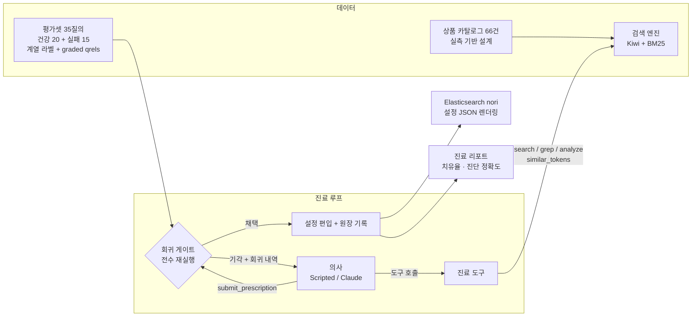

# ko-search-clinic

**한국어 검색 품질 자가 치유 에이전트 — 진단 · 처방 · 검증 · 롤백**

한국어 검색은 조용히 실패합니다. 사용자가 `후라이팬`을 검색하면 `프라이팬`
상품은 0건이고, `티슈`를 검색하면 `물티슈`는 영원히 안 나오고, `아답터`는
형태소 분석기가 `[아, 답, 터]`로 부숴 버립니다. 현장의 대응은 수동입니다 —
누군가 민원을 받고, 사전이나 동의어 파일을 고치고, **그 수정이 다른 검색을
망가뜨렸는지는 아무도 확인하지 않습니다.**

이 프로젝트는 그 전체 과정을 에이전트로 자동화하되, 핵심을 검증에 둡니다:

```
실패 질의 → [진단] 왜 못 찾았나 — 형태소 단위 원인 규명 (5개 실패 계열)
         → [처방] 타입 있는 패치 — 사용자 사전 | 동의어 | 복합어 분해 확장
         → [검증] 회귀 게이트 — 전체 평가셋 재실행: 표적 개선 + 무회귀 + 전체 보존
         → [채택] 원장에 증거와 함께 기록  /  [기각] 회귀 내역을 돌려주고 재처방 유도
```

**처방은 의사의 확신이 아니라 전수 재실행 결과로 채택됩니다.** 기각 = 롤백이며,
채택된 모든 패치에는 "왜 넣었는지"의 증거(전/후 지표)가 원장에 남습니다.

## 핵심 결과 (오프라인 베이스라인, API 키 불필요)

`clinic heal --engine scripted` — 실패 질의 15건 순회 진료:

| 지표 | 전 | 후 |
|---|---|---|
| 실패셋 제로결과율 | **87%** | **20%** |
| 실패셋 평균 nDCG@10 | 0.074 | **0.741** |
| 건강셋(20개 질의) 회귀 | — | **0건** (게이트 보증) |
| 치유율 | — | 10/15 (67%) |

휴리스틱 의사(자모 유사도 + 부분어 포함 규칙)가 고치는 것과 **원리적으로 못
고치는 것**의 경계가 정확히 측정됩니다. 그리고 못 고치는 5건은 LLM 의사가
전부 치유했습니다 — 같은 게이트를 통과해서:

| 계열 | 예 | 휴리스틱 | Claude | 경계선의 이유 |
|---|---|---|---|---|
| 표기 변형 (8건) | 후라이팬→프라이팬, 케잌→케이크 | ✅ 8/8 | — | 자모 편집 거리가 잡는다 |
| 복합어 통짜 (2건) | 티슈↛물티슈, 머스캣↛샤인머스캣 | ✅ 2/2 | — | 부분어 포함 규칙이 잡는다 |
| **영한 혼용 (2건)** | 블루투스↛Bluetooth, 텀블러↛tumbler | ❌ 0/2 | **✅ 2/2** | 자모 유사도는 문자 체계를 못 넘는다 |
| **유의어 (2건)** | 츄리닝↛트레이닝복, 핸드폰↛휴대폰 | ❌ 0/2 | **✅ 2/2** | 형태가 다른 같은 뜻 — 의미 이해 필요 |
| **쓰레기 분해 (2건)** | 아답터→[아,답,터], 백팩→[백,팩] | ❌ 0/2 | **✅ 2/2** | 사전 등록→동의어의 **2단계 처방**을 모른다 |

**Claude 실측 (베이스라인이 실패한 6건): 치유 6/6 · 진단 정확 6/6 · 기각 0회 ·
평균 3.7턴.** 전체 16건은 아직 미실측이며, 위 6건은 베이스라인이 실패한
**변별력 있는 부분집합**입니다. 자세한 진료 기록과 한계는
[docs/EVALUATION.md](docs/EVALUATION.md).

> 평가 하니스 자신의 결함도 실측이 찾아냈습니다. 한 번의 실행이 "엉뚱한 질의의
> 처방을 채택하고 원래 질의를 치유했다고 보고하는" 구멍을 드러냈습니다 —
> 치유율 숫자를 통째로 거짓으로 만들 수 있는 구멍이고, 평가셋에 정상적으로 있는
> 질의만으로도 재현됩니다. 세 구멍을 막아 회귀 테스트로 고정했습니다 —
> [docs/EVALUATION.md](docs/EVALUATION.md#평가-하니스-자신의-결함--실측이-찾아낸-것).

**LLM의 가치가 "그럴듯함"이 아니라 치유율 격차로 측정됩니다.**

## 회귀 게이트가 실제로 잡는 것

`clinic demo-trap` — 과잉 동의어(프라이팬=후라이팬=**팬**)를 제출하면:

```
기각: 다른 질의 2건에 회귀 발생
  - 회귀: '프라이팬' ndcg 1.00 → 0.65
  - 회귀: '프라이팬' precision5 1.00 → 0.40
  - 회귀: '팬미팅 굿즈' precision5 0.50 → 0.40
처방을 더 좁히거나(대상 항목 축소) 다른 패치 유형을 검토하라.
```

`팬` 토큰을 가진 팬미팅 굿즈·선풍기 문서가 프라이팬 검색에 쏟아져 들어오는
것을 **전수 재실행이 잡아냅니다.** nDCG만으로는 부족해서 precision@5를 함께
봅니다 — nDCG는 정답 아래에 쌓이는 쓰레기를 벌하지 않기 때문입니다. 좁힌
처방(프라이팬=후라이팬)은 즉시 채택됩니다.

## 왜 이 주제인가

한국어 검색 품질 운영(사전·동의어·decompound 관리)은 국내 모든 검색 서비스가
하는 일이지만, 공개된 자료는 전부 **수동 설정 튜토리얼**입니다. LLM으로 동의어를
생성하는 시도(Elastic 공식 블로그)는 있어도 (1) 형태소 수준 **진단**, (2) 회귀
게이트 있는 **검증**, (3) 기각 피드백 기반 **재처방** 루프를 갖춘 공개 도구는
찾지 못했습니다. 한국어 형태소는 영어권 오픈소스가 다루지 않고, 형태소가 없으면
이 문제 자체가 성립하지 않습니다.

## 구성 요소

| 구성 요소 | 구현 |
|---|---|
| 형태소 분석 | **Kiwi**(kiwipiepy) + 설정 계층: 사용자 사전 / 동의어 정규화 / 복합어 분해 확장(nori decompound mixed 대응) |
| 검색 엔진 | **BM25 역색인 직접 구현** (Lucene 방식 IDF, k1=1.2, b=0.75, 결정적 순위) |
| 표기 변형 탐지 | **자모 분해 편집 거리** 직접 구현 (케잌↔케이크 = 0.67, 유니코드 산술) |
| 처방 IR | pydantic 모델 — 스키마 위반은 제출 시점 거부, 복합 처방(사전+동의어) 지원 |
| 회귀 게이트 | 전체 평가셋 전수 재실행: 표적 개선 + 질의별 무회귀(nDCG·recall·precision@5) + 전체 평균 보존 |
| 패치 원장 | 채택된 모든 패치에 표적 질의·진단 근거·전후 지표 기록 — "왜 넣었는지 모르는 사전 항목" 방지 |
| ES 렌더러 | 채택 설정 → **Elasticsearch nori 설정 JSON** (user_dictionary_rules / synonym_graph / decompound_mode) 1:1 렌더링 |
| 의사 엔진 | ScriptedDoctor(결정적 베이스라인) + Claude(수동 tool-use 루프) — 같은 LLMClient 프로토콜 |
| 평가 | 치유율 · **진단 정확도**(계열 라벨 대조) · **처방 적합성**(패치 유형 대조) · 건강셋 회귀 감시 |

## 아키텍처



의사에게 정답표(qrels)는 보이지 않습니다. 의사가 보는 것은 검색 결과·원문
grep·형태소 분석뿐이고, 채점은 게이트만 합니다 — 시험지와 채점표의 분리입니다.

## 빠른 시작

```bash
git clone <repo-url> && cd ko-search-clinic
python -m venv .venv && source .venv/bin/activate
pip install -e ".[dev]"

# 1) 실패를 눈으로 확인
clinic search "후라이팬"        # 0건 — 문서는 전부 '프라이팬'
clinic analyze "아답터"         # [아, 답, 터] 쓰레기 분해
clinic evaluate                 # 치유 전 전체 채점

# 2) 진료 한 건 (진료 기록 출력)
clinic diagnose "티슈" --engine scripted

# 3) 회귀 게이트 시연 — 이 프로젝트의 핵심
clinic demo-trap

# 4) 전체 치유 + 리포트/원장/ES 설정 생성
clinic heal --engine scripted --output docs/CLINIC_REPORT.md \
    --ledger docs/LEDGER.json --es-output docs/ES_SETTINGS.json

# 5) Claude 의사 (ANTHROPIC_API_KEY 필요) — 베이스라인이 남긴 5건에 도전
export ANTHROPIC_API_KEY=sk-ant-...
clinic diagnose "츄리닝" --engine claude
clinic heal --engine claude

# 테스트 (72개, 전부 오프라인)
pytest
```

## 기술적 의사결정

| 결정 | 이유 |
|---|---|
| 코퍼스를 **실측 위에 설계** | 실패 시나리오를 상상으로 쓰지 않았다. Kiwi의 실제 분석(아답터→[아,답,터], 물티슈=한 토큰, 팬미팅→[팬,미팅])을 먼저 측정하고 그 위에 문서·질의·함정을 배치했다. 계약은 `test_corpus_contract.py`가 지킨다 |
| **검증을 도구 안에** 내장 | `submit_prescription`이 곧 게이트다. 의사(LLM 포함)는 검증을 건너뛸 방법이 없다 |
| 의사에게 **qrels 은닉** | 정답표를 보면 진단이 아니라 답 맞추기가 된다. 의사는 증거(검색/grep/분석)만 보고, 채점은 게이트가 한다 |
| nDCG에 **precision@5 추가** | nDCG는 정답 아래 쓰레기를 벌하지 않는다. 과잉 동의어 오염은 precision@5가 잡는다 (demo-trap의 근거) |
| 기각을 **정보로 반환** | 기각 피드백에 어떤 질의가 얼마나 나빠졌는지 담아 재처방(자가 수정)을 유도 — 실패가 루프의 입력이 된다 |
| **복합 처방** 지원 | 아답터는 사전 등록과 동의어가 함께 있어야만 고쳐진다. 단일 패치 IR로는 표현 불가능한 실재 사례 |
| 진단 정확도를 **별도 채점** | 치유율만 보면 "우연히 고침"과 "이해하고 고침"이 안 갈린다. 계열 라벨 대조가 그 구분을 만든다 |
| BM25·자모 거리 **직접 구현** | 랭킹의 결정성이 곧 채점의 결정성이다. 같은 입력이면 항상 같은 순위·같은 판정 |
| Kiwi 인스턴스 **캐시** | 초기화가 ~2초라 게이트의 샌드박스 생성마다 새로 만들면 진료가 분 단위가 된다. 등록 단어 집합이 같으면 공유 (동의어·확장은 파이썬 후처리라 안전) |
| ES 렌더러는 **1:1 대응** | 로컬 패치 의미가 nori 설정(user_dictionary_rules/synonym/decompound_mode)과 정확히 대응하도록 패치 유형 자체를 설계 — 장난감이 아니라 이식 가능한 산출물 |

## 프로젝트 구조

```
src/searchclinic/
├── analysis/      # Kiwi 분석기 + 설정(사전/동의어/분해), 자모 거리
├── index/         # BM25 역색인, 검색 엔진(설정 교체 = 재색인)
├── corpus/        # 상품 카탈로그 66건 + 평가셋 35질의 (실측 기반 설계)
├── patch/         # 처방 IR(pydantic), 회귀 게이트, ES nori 렌더러
├── doctor/        # 진료 도구, 진료 루프, ScriptedDoctor, Claude 클라이언트
├── evaluation/    # 지표(nDCG/recall/precision@5), 하니스, 패치 원장
└── cli.py         # clinic analyze/search/evaluate/diagnose/heal/demo-trap/export-es
tests/             # 72개 테스트 (전부 오프라인, API 키 불필요)
docs/              # 설계 문서 + CLI가 생성한 리포트/원장/ES 설정
```

## 문서

- [docs/ARCHITECTURE.md](docs/ARCHITECTURE.md) — 계층별 설계와 실측 기록
- [docs/EVALUATION.md](docs/EVALUATION.md) — 평가 방법론: 왜 이렇게 채점하는가
- [docs/CLINIC_REPORT.md](docs/CLINIC_REPORT.md) · [docs/LEDGER.json](docs/LEDGER.json) · [docs/ES_SETTINGS.json](docs/ES_SETTINGS.json) — CLI가 생성한 실측 결과물

## 한계와 다음 단계

- **합성 평가셋**: 질의·문서·정답을 같은 사람이 설계했다. 수치의 절대값보다
  구조(게이트·원장·계열 채점)가 산출물이다. 실제 검색 로그의 제로결과 질의를
  물리는 것이 다음 단계
- **Claude 의사 실측**: 베이스라인이 남긴 5건(영한·유의어·2단계)에 대한 LLM
  치유율 실측 및 리포트 갱신
- **ES 실연결**: 렌더링된 설정을 실제 Elasticsearch에 적용하고 같은 평가셋을
  ES 위에서 재실행하는 어댑터 (렌더러는 완성, 어댑터는 로드맵)
- **처방 유형 확장**: 오탈자 교정(質의 시점), 불용어, 가중치 필드 부스팅

## 라이선스

MIT
